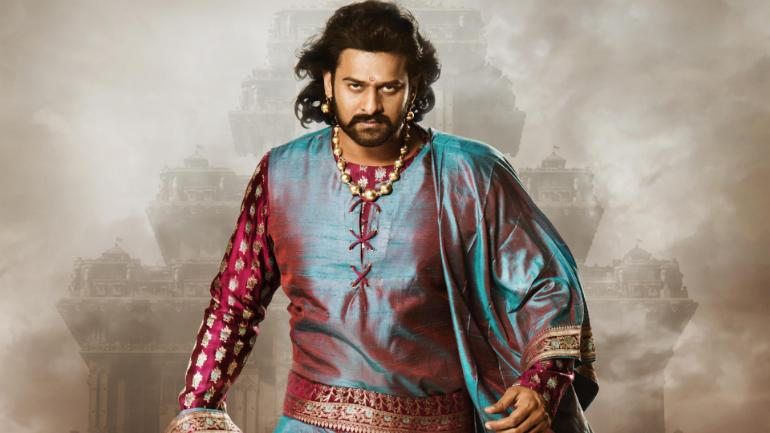
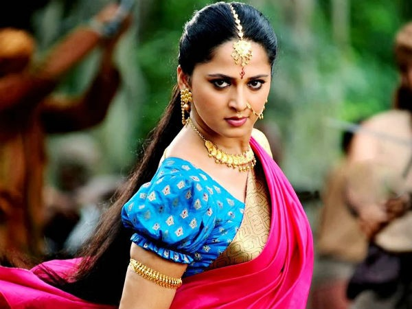
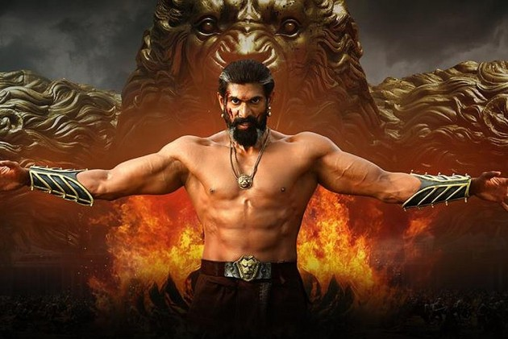

# BAAHUBALI -THE MOVIE
Baahubali is an India's biggest motion picture. There are 2 parts. This page gives the information about the movie and the main characters involved in it.
1. Baahubali -The Begining.
2. Baahubali -The conclusion..

## CAST:

1.Prabhas as Baahubali

2.Anushka Shetty as Devasena

3.Rana as bhallaladeva

## Description About Characters:
- Baahubali:
Bahubali is the king of mahishmathi and he is the younger brother of bhallaladeva. Prabhas played a dual role in this movie as Amarendra bahubali, Mahendra Bahubali. The story revolves around who takes the power to control Mahismathi Kingdom.

- Devasena:
Devasena is the lead female character of the Baahubali and also princess of Kuntala Kingdom. Devasena is a skilled fighter and a great archer. She is brave and bold and believes firmly in her decisions. She practices a lot to improve her martial skills. Devasena marries Baahubali, with whom she has a child, Mahendra Baahubali.

- Bhallaladeva:
Bhallaladeva played a antagonist role in this movie and he is son of Bijjaladeva. He is envious of Amarendra Baahubali. Bhallaladeva takes Devasena as a prisoner and frequently taunts her in her captive. 
 
## References:
- [Baahubali wikipedia page](https://en.wikipedia.org/wiki/Baahubali:_The_Beginning)

- [Baahubali Movie](https://www.youtube.com/watch?v=nI7xZM8M3FE)

- [Baahubali -The Conclusion](https://en.wikipedia.org/wiki/Baahubali_2:_The_Conclusion)
